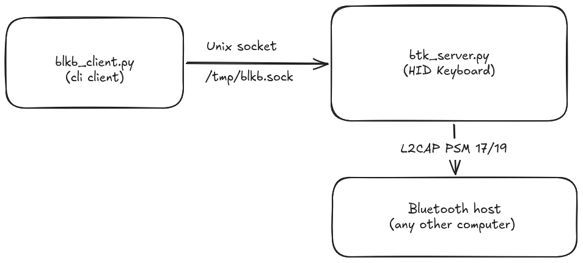

# BLKB — Bluetooth Keyboard Emulator

Emulate a Bluetooth HID keyboard from Linux. Pairs with a host (Windows, macOS, etc.) as a keyboard peripheral. A CLI client sends keystrokes, file contents with random delays, or interactive input over a Unix socket.

## Architecture



(see other Architectural diagram on docs/)

## Files

| File | Purpose |
|---|---|
| `btk_server.py` | HID keyboard daemon — listens on L2CAP PSMs 17/19, handles pairing, Unix socket command server |
| `blkb_client.py` | CLI client — sends commands to the server |
| `keymap.py` | USB HID scancode table |
| `sdp_record.xml` | HID SDP service record |

## Requirements

- Python 3.10+
- BlueZ 5.x (with `--noplugin=input` support)
- `dbus-python`, `PyGObject` (GLib main loop)
- Bluetooth adapter (BR/EDR)
- `sudo` for Bluetooth operations

## Quick Start (any Linux)

### 1. Configure

Edit `MY_ADDRESS` and `MY_DEV_NAME` in `btk_server.py`:

```python
MY_ADDRESS = "A0:80:69:D1:B1:35"   # your adapter's BT MAC
MY_DEV_NAME = "Logitech_K380"       # advertised name
```

Find your MAC with:
```sh
hciconfig hci0 | awk '/BD Address:/{print $3}'
```

### 2. Disable BlueZ input plugin

The HID profile must be handled by our script, not BlueZ's built-in input plugin.

**Systemd distros** — override the bluetooth service to pass `--noplugin=input`:

```sh
sudo mkdir -p /etc/systemd/system/bluetooth.service.d/
cat <<EOF | sudo tee /etc/systemd/system/bluetooth.service.d/override.conf
[Service]
ExecStart=
ExecStart=/usr/libexec/bluetooth/bluetoothd --noplugin=input
EOF
sudo systemctl daemon-reload
sudo systemctl restart bluetooth
```

**Alternatively**, if you don't want a permanent override, stop systemd bluetooth and start a custom instance:

```sh
sudo systemctl stop bluetooth
sudo systemctl kill bluetooth
sudo bluetoothd --noplugin=input &
```

### 3. Run the server

```sh
sudo python3 btk_server.py
```

On first run, pair from the host. The server uses `DisplayOnly` IO capability (Just Works — no PIN prompt). Windows will show the device under both Audio and Keyboard categories; clicking "Connect" should pair it as an input device.

### 4. Send keystrokes

```sh
# Send text
python3 blkb_client.py type "hello world"

# Send special keys
python3 blkb_client.py key enter
python3 blkb_client.py key tab
python3 blkb_client.py key f5
python3 blkb_client.py key right

# Modifier + key
python3 blkb_client.py mod ctrl r
python3 blkb_client.py mod alt f4

# Interactive mode
python3 blkb_client.py direct
# Type text and press Enter to send
# Use / commands: /key enter, /mod ctrl r, /delay 5000

# Type a file with random delays (blocks, Ctrl-C to stop)
python3 blkb_client.py file document.txt --delay-min 30 --delay-max 180 --chunk-size 200
```

## Client Commands

| Command | Description |
|---|---|
| `type <text>` | Send text as keystrokes |
| `key <name>` | Send special key: `enter`, `tab`, `backspace`, `escape`, `up`, `down`, `left`, `right`, `f1`–`f12`, `home`, `end`, `pageup`, `pagedown`, `delete`, `insert`, `capslock` |
| `mod <mod> <key>` | Modifier + key: `mod ctrl r`, `mod shift a`, `mod alt f4`, `mod win d` |
| `file <path>` | Type entire file (blocking). Options: `--delay-min <sec>` (default 30), `--delay-max <sec>` (default 180), `--chunk-size <n>` (default 5). Random pause between chunks. |
| `direct` | Interactive line-by-line mode. Lines starting with `/` are commands (`/key enter`, `/mod ctrl r`, `/delay 5000`). |
| `-s <socket>` | Custom Unix socket path (default `/tmp/blkb.sock`) |

## NixOS

### 1. Override bluetooth service

In your `configuration.nix`:

```nix
systemd.services.bluetooth.serviceConfig.ExecStart =
  [ "" "${pkgs.bluez}/libexec/bluetooth/bluetoothd --noplugin=input" ];
```

`nixos-rebuild switch`, then reboot (or `sudo systemctl restart bluetooth`).

### 2. Enter dev shell

```sh
nix-shell
```

### 3. Run server

```sh
sudo python3 btk_server.py
```

If `dbus-python` or `PyGObject` are missing, install them:

```nix
(python3.withPackages (ps: with ps; [ dbus-python pygobject3 ]))
```

### 4. Use client

From another terminal (not necessarily in `nix-shell`):

```sh
python3 blkb_client.py file myfile.txt --delay-min 30 --delay-max 180 --chunk-size 200
```

## How It Works

1. **Bluetooth setup**: D-Bus configures the adapter (powered, discoverable, pairable, device name).
2. **Agent registration**: Registers a `DisplayOnly` BlueZ agent that auto-confirms all pairing requests (Just Works — no PIN).
3. **SDP record**: Registers the HID service SDP record via `org.bluez.ProfileManager1` (no `AutoConnect` — SDP only).
4. **Device class**: Sets class to `0x0025C0` (Peripheral, Combo keyboard/pointing).
5. **Raw L2CAP sockets**: Listens on PSM 17 (HID Control) and PSM 19 (HID Interrupt) for incoming connections.
6. **HIDP protocol**: Responds to GET_REPORT, SET_REPORT, SET_PROTOCOL, etc. on the control channel.
7. **Command server**: Unix socket at `/tmp/blkb.sock` accepts commands from the client. Commands are queued and executed via GLib timers (non-blocking).
8. **Keystroke sending**: Each character is sent as key-down + 50ms delay + key-up on the interrupt channel.

## Troubleshooting

| Symptom | Cause / Fix |
|---|---|
| Windows shows "Couldn't connect" | The BT adapter might not have `--noplugin=input`. Check `ps aux \| grep bluetoothd`. |
| Windows shows PIN prompt | IO capability mismatch. The script sets `DisplayOnly` for Just Works. If Windows still asks for PIN, try `btmgmt io-cap 3` before running the script (not needed normally). |
| Characters skipped on host | Increase inter-character delay: edit `GLib.timeout_add(50, ...)` to `100` in `btk_server.py`. |
| "Address already in use" on PSM 17/19 | Another process claims HID PSMs. Likely the input plugin is not disabled. Restart bluetoothd with `--noplugin=input`. |
| Client says "Connection refused" | Server not running or socket path wrong. Check `/tmp/blkb.sock` exists. |
| Host sees Audio but not Keyboard | The audio services are built into BlueZ and can't be disabled. Ignore them — Windows should still offer keyboard connection. |

## Credits

Based on [keyboard_mouse_emulate_on_raspberry](https://github.com/quangthanh010290/keyboard_mouse_emulate_on_raspberry).
